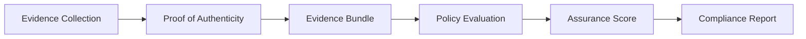

# Confidior

**Honest, graded, attack-aware assurance. For any evidence you can verify.**

Compliance tools give you a checklist. Security scanners give you a list of CVEs. Neither tells you what your actual residual risk is. Confidior connects evidence to attacks to compliance controls, and grades the result honestly.

TEE attestations, SBOMs, IaC snapshots, formal proofs. All evidence. Confidior grades it: not pass/fail, but a profile with residual risk, attack costs, trust maps, and compliance mapping. The engine is built around a generalizable evidence graph. Right now it eats TEE attestation reports. The architecture doesn't care what you feed it. Only the adapters and mappings change.

BadRAM ($10), Battering RAM ($50), TEE.fail, and 44 other attacks proved that confidential computing can't be graded with a green checkmark. So we don't.

## How It's Different

Most assurance tools do one of two things: verify crypto (is the signature valid?) or check compliance (did you tick the box?). Confidior does both, then adds the missing layer: **what's your actual risk after verification passes?**

A valid TEE quote doesn't mean you're safe. It means the hardware attested the software. Physical DRAM attacks bypass the hardware entirely. Confidior knows this because it tracks 44 published attacks with cost estimates and mitigation status. When it grades a platform as CRITICAL, that's not a false positive. It's the honest answer.

The evidence graph ties it together. Nodes are evidence artifacts. Edges are relationships (derives-from, satisfies, references). The graph lets you correlate across platforms, track dependencies, and see the full trust chain. It's not a point solution for one attestation type. It's an evaluation engine that works on whatever evidence you can parse into a node.

## What It Does

1. **Ingests** raw evidence (TEE quotes today; SBOMs, IaC, formal proofs on the roadmap)
2. **Authenticates** it with cryptographic proofs (signatures, cert chains, transparency logs)
3. **Evaluates** it against policies (YAML DSL) with attack-aware risk scoring on the evidence graph
4. **Outputs** signed evidence bundles with multi-dimensional assurance profiles, compliance mappings, and optional transparency log anchoring

## Quick Start

```bash
uv sync

# Verify a TDX quote (basic; ephemeral key; pass --no-rekor to skip Rekor)
uv run python -m src.cli.main verify --input tests/fixtures/tdx/sample_quote.hex --platform tdx --policy tests/fixtures/policy/default.yaml --output-dir ./output --workload my-workload

# Verify with operator-persistent key + Rekor anchoring (Present / signed trust)
uv run python -m src.cli.main verify --key-path ~/.confidior/op-key.json --input tdx.hex --platform tdx --policy default.yaml --output-dir ./out
# First run: creates ~/.confidior/op-key.json (chmod 600)
# Subsequent runs: reuses the same key
# Bundle is auto-anchored to Sigstore Rekor; inclusion proof embedded in bundle

# Skip Rekor anchoring (offline mode; bundle is signed but unanchored)
uv run python -m src.cli.main verify --no-rekor --input tdx.hex --platform tdx --policy default.yaml --output-dir ./out

# Outputs:
#   evidence_bundle.json   - Signed attestation bundle (with optional Rekor inclusion proof)
#   report.md              - Assurance evaluation report
#   c5_report.md           - C5:2026 compliance mapping
#   badge.svg              - Verifiable assurance badge
```

## Web UI (Experimental)

A local web interface for submitting attestations, browsing archaeology data, and verifying bundles.

```bash
uv sync
uv run python -m src.web.app
```

Opens at `http://127.0.0.1:8000`. Routes: `/submit` (upload attestation), `/verify` (verify bundle), `/archaeology` (attack/CVE browser).

> **Experimental.** The web UI is a demo surface, not a product. It runs locally, shares the engine's codebase directly, and may be moved to its own repository later. For the CLI-based evaluation pipeline, see **Quick Start** above.

## Trust Levels

The badge has different cryptographic assurance levels depending on how it's signed.

| Level | What the badge proves | What you'd trust it for |
|---|---|---|
| **Present (unsigned)** (no `--key-path`) | The engine ran. Anyone could have run it. | Internal risk grading only. |
| **Present (signed)** (`--key-path` + auto-Rekor) | A specific operator signed it. Bundle anchored to public Sigstore Rekor via hashedrekord (content never revealed to Rekor). | Internal risk grading, honest reporting, demos. |
| **Near future** (Confidior counter-signs, when available) | Confidior reviewed the operator-signed bundle. Verifier can check Confidior's public key + Rekor anchor. | Enterprise compliance submissions, customer-facing security claims. |

Present (signed) is what you get with the default CLI flags today. Near future needs the Hosted Verify API.

## Assurance Output

Not a binary pass/fail. Every evaluation produces a multi-dimensional profile:

| Dimension | What it measures | Example |
|-----------|-----------------|---------|
| **Level (0-5)** | Evidence strength | 2 = Hardware-Attested |
| **Residual Risk** | Attack cost + mitigation difficulty | CRITICAL (BadRAM $10 unmitigated) |
| **Temporal Freshness** | Evidence age vs TTL | FRESH (collected 2 min ago, TTL 30 min) |
| **Compliance Coverage** | % of controls satisfied | 11 SATISFIED, 9 PARTIAL, 442 GAP (C5:2026, TDX with default policy) |

The parameters and leveling systems involved in this output may be refined and enhanced as the project progresses.

## Attack-Aware Risk Scoring

Residual risk factors in 44 tracked TEE attacks across 12 categories:

- **$10-$50 attacks** (BadRAM, Battering RAM) → CRITICAL if unmitigated
- **$1,000+ attacks** (TEE.fail) → CRITICAL (base HIGH + hardware redesign escalation)
- **Hardware redesign required** → risk escalates by one additional tier

Single-vendor cloud TEEs (TDX, SEV-SNP) evaluate to CRITICAL residual risk because physical DRAM attacks are unmitigated. Nitro evaluates to HIGH (no Nitro-specific attacks in the DB yet). That's not a bug. It's honest.

## Compliance Mapping

C5:2026 (BSI): all 18 control families, 462 controls. Technical controls evaluated via attestation evidence. Organizational controls marked GAP with explicit reason. SOC2, HIPAA, GDPR planned.

The compliance mapper is plugin-shaped. C5 is the first framework. Adding another means writing a YAML mapping file, not rewriting the engine.

## Architecture



- `src/core/` taxonomy, risk scoring, policy engine, attack database, evidence graph
- `src/ingest/` platform adapters (TDX, SEV-SNP, Nitro) + raw framework data
- `src/export/` bundle signing, SVG badges, compliance reports, Rekor anchoring
- `src/cli/` CLI entry point
- `src/web/` FastAPI web GUI (dashboard, evaluate, results, mappings, archaeology)
- `data/` C5:2026 YAML definitions (18 families, 462 controls)
- `tests/` 163 passing tests

## Development

```bash
uv run pytest          # Run tests
uv run ruff check .    # Lint
uv run mypy src/       # Type check
```

## Data Provenance

- C5:2026 YAML: BSI `Cloud Computing Compliance Controls Catalogue` v2026-04, extracted from official ZIP
- TDX fixture: Synthetic quote for deterministic evaluation (1726 bytes); real quote from edgelesssys/go-tdx-qpl (4936 bytes) available as `tests/fixtures/tdx/real_quote.hex`
- SEV-SNP/Nitro fixtures: Real attestation reports from AWS CI sample workloads; with synthetic variants for edge case testing
- Attack database: Academic literature 2016-2026, curated from published papers and CVE feeds with source URLs

## What's Not Here (Yet)

- Full measurement CI (reproducible builds to compute expected measurements)
- Evidence graph visualization (node-link diagram)
- Confidior counter-signing + public key registry (hosted Verify API)
- Complete real hardware validation (DevCloud, AWS r7iz.metal, EPYC 9004): Pending
- Documentation laying out the Trust Model
- ...and more to come

## AI Assistance

Portions of this codebase and documentation were developed with AI assistance (large language models). Every contribution - code, tests, docs - has been reviewed, validated, and stress-tested by me. Thorough vetting is ensured to the extent possible given the complexity of confidential computing attestation, but as with any software project, independent review is encouraged; and feedbacks are welcome.


## License

Apache 2.0
